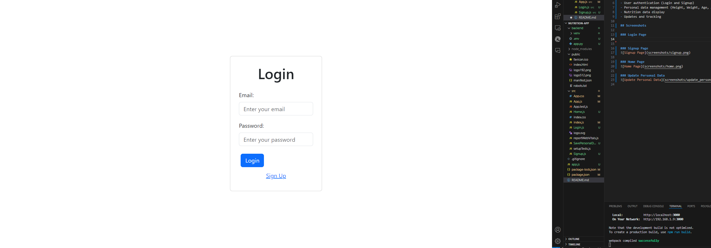
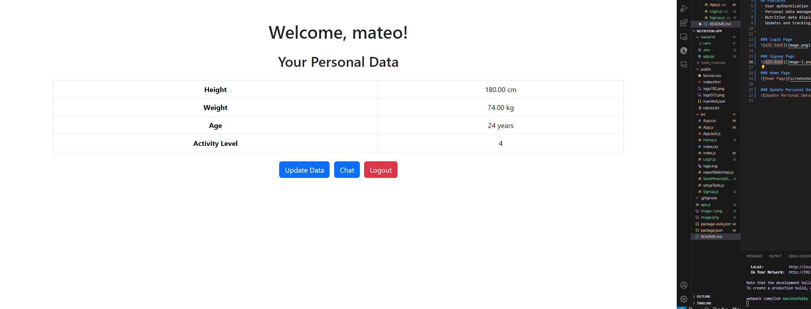
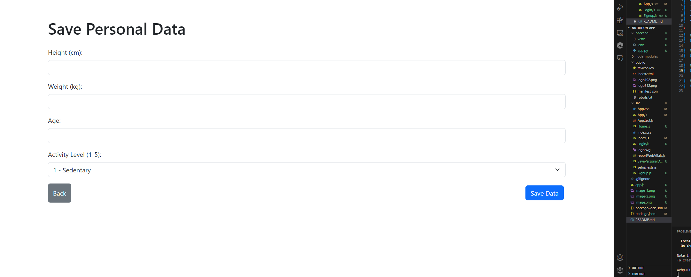
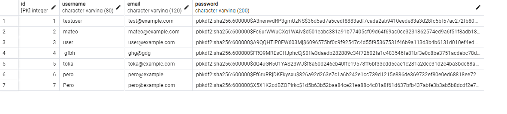

# Nutrition App

This is a full-stack web application for tracking and analyzing nutrition data. The app allows users to sign up, log in, and manage their personal health-related data.

## Features
- User authentication (Login and Signup)
- Personal data management (Height, Weight, Age, Activity Level)
- Nutrition data display
- Updates and tracking

## Technologies Used

### Frontend
- **React.js**: The frontend of the application is built using **React**, a popular JavaScript library for building user interfaces. React provides a seamless way to manage user interactions and state across components, making it easy to handle dynamic forms and UI components.

### Backend
- **Python Flask**: The backend is powered by **Flask**, a lightweight and flexible Python web framework. Flask handles the API requests, user authentication, and interaction with the database, serving as the interface between the frontend and the backend services.
  
### Database
- **PostgreSQL**: The application uses **PostgreSQL**, a powerful, open-source relational database system. It is used for storing user credentials and personal health data, ensuring data integrity and reliability.

### Login Page

### Signup Page

### Home Page

### Update Personal Data

### PostgreSQL user table

### PostgreSQL personal_data table

